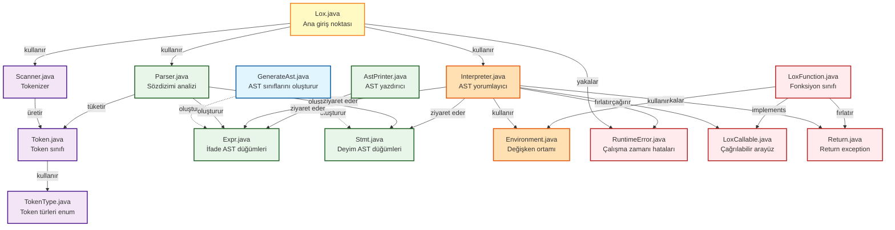

```mermaid
graph TB
    %% Tool package
    GenerateAst[GenerateAst.java<br/>AST sınıflarını oluşturur]
    
    %% Main entry point
    Lox[Lox.java<br/>Ana giriş noktası]
    
    %% Lexical analysis
    Scanner[Scanner.java<br/>Tokenizer]
    Token[Token.java<br/>Token sınıfı]
    TokenType[TokenType.java<br/>Token türleri enum]
    
    %% Parsing
    Parser[Parser.java<br/>Sözdizimi analizi]
    Expr[Expr.java<br/>İfade AST düğümleri]
    Stmt[Stmt.java<br/>Deyim AST düğümleri]
    
    %% Interpretation
    Interpreter[Interpreter.java<br/>AST yorumlayıcı]
    Environment[Environment.java<br/>Değişken ortamı]
    
    %% Runtime
    RuntimeError[RuntimeError.java<br/>Çalışma zamanı hataları]
    LoxCallable[LoxCallable.java<br/>Çağrılabilir arayüz]
    LoxFunction[LoxFunction.java<br/>Fonksiyon sınıfı]
    Return[Return.java<br/>Return exception]
    
    %% AST Printing
    AstPrinter[AstPrinter.java<br/>AST yazdırıcı]
    
    %% Relationships - Tool
    GenerateAst -.->|oluşturur| Expr
    GenerateAst -.->|oluşturur| Stmt
    
    %% Relationships - Main flow
    Lox -->|kullanır| Scanner
    Lox -->|kullanır| Parser
    Lox -->|kullanır| Interpreter
    Lox -->|yakalar| RuntimeError
    
    %% Relationships - Scanner
    Scanner -->|üretir| Token
    Token -->|kullanır| TokenType
    
    %% Relationships - Parser
    Parser -->|tüketir| Token
    Parser -->|oluşturur| Expr
    Parser -->|oluşturur| Stmt
    
    %% Relationships - Interpreter
    Interpreter -->|ziyaret eder| Expr
    Interpreter -->|ziyaret eder| Stmt
    Interpreter -->|kullanır| Environment
    Interpreter -->|fırlatır| RuntimeError
    Interpreter -->|çağırır| LoxCallable
    Interpreter -->|yakalar| Return
    
    %% Relationships - Function
    LoxFunction -->|implements| LoxCallable
    LoxFunction -->|kullanır| Environment
    LoxFunction -->|fırlatır| Return
    
    %% Relationships - AST Printer
    AstPrinter -->|ziyaret eder| Expr
    
    %% Styling
    classDef toolClass fill:#e1f5ff,stroke:#01579b,stroke-width:2px
    classDef mainClass fill:#fff9c4,stroke:#f57f17,stroke-width:2px
    classDef scanClass fill:#f3e5f5,stroke:#4a148c,stroke-width:2px
    classDef parseClass fill:#e8f5e9,stroke:#1b5e20,stroke-width:2px
    classDef interpClass fill:#ffe0b2,stroke:#e65100,stroke-width:2px
    classDef runtimeClass fill:#ffebee,stroke:#b71c1c,stroke-width:2px
    
    class GenerateAst toolClass
    class Lox mainClass
    class Scanner,Token,TokenType scanClass
    class Parser,Expr,Stmt,AstPrinter parseClass
    class Interpreter,Environment interpClass
    class RuntimeError,LoxCallable,LoxFunction,Return runtimeClass

   %% How to compile: 
   %% $ javac -d . tool/GenerateAst.java 
   %% $ java craftinginterpreters.tool.GenerateAst lox/
   %% $ javac -d classes lox/*.java

   %% OR
   %% /craftinginterpreters$ javac -d . tool/GenerateAst.java && java craftinginterpreters.tool.GenerateAst lox/ && javac -d classes lox/*.java
```